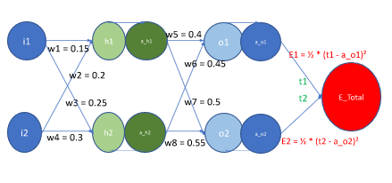
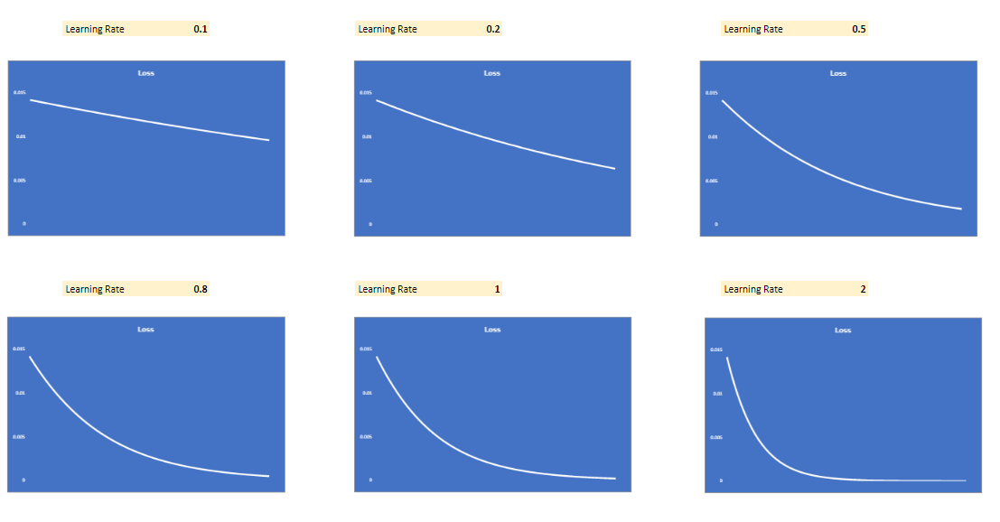

## Part 1

This backpropagation calculation is based on the architecture of a simple neural network with a single hidden layer and an output layer. The steps taken here follow the chain rule to calculate the gradients with respect to each weight in the network, which is essential for updating the weights in the training process to minimize the error.




**Step 1 Forward Propagation**: The first set of equations represents the process of forward propagation where we calculate the output of the network based on the inputs and the weights.
    
```python
    h1 = w1*i1 + w2*i2
    h2 = w3*i1 + w4*i2
    a_h1 = σ(h1) = 1/(1 + exp(-h1))
    a_h2 = σ(h2)
    o1 = w5*a_h1 + w6*a_h2
    o2 = w7*a_h1 + w8*a_h2
    a_o1 = σ(o1)
    a_o2 = σ(o2)
    E_total = E1 + E2
    E1 = ½ * (t1 - a_o1)²
    E2 = ½ * (t2 - a_o2)²
```

**Step 2**: Here we calculate the derivative of the total error with respect to the weight w5. We have split this process into three sub-steps according to the chain rule of differentiation. The first term is the derivative of the error with respect to the output of the node, the second term is the derivative of the activation function (which is a sigmoid function in this case), and the third term is the derivative of the output with respect to the weight w5.

```python
    ∂E_total/∂w5 = ∂(E1 + E2)/∂w5
    ∂E_total/∂w5 = ∂E1/∂w5
    ∂E_total/∂w5 = ∂E1/∂w5 = ∂E1/∂a_o1*∂a_o1/∂o1*∂o1/∂w5
    ∂E1/∂a_o1 = ∂(½ * (t1 - a_o1)²)/∂a_o1 = (a_01 - t1)
    ∂a_o1/∂o1 = ∂(σ(o1))/∂o1 = a_o1 * (1 - a_o1)
    ∂o1/∂w5 = a_h1
```
**Step 3**: Now, we are actually calculating the gradient of the error with respect to each weight w5, w6, w7, w8 in the output layer. This will be used later to update these weights.

```python
    ∂E_total/∂w5 = (a_01 - t1) * a_o1 * (1 - a_o1) *  a_h1
    ∂E_total/∂w6 = (a_01 - t1) * a_o1 * (1 - a_o1) *  a_h2
    ∂E_total/∂w7 = (a_02 - t2) * a_o2 * (1 - a_o2) *  a_h1
    ∂E_total/∂w8 = (a_02 - t2) * a_o2 * (1 - a_o2) *  a_h2
```
**Step 4**: We calculate the derivative of the total error with respect to the activations of the hidden layer. We use the chain rule again to find the gradients of the error with respect to a_h1 and a_h2.

```python
    ∂E1/∂a_h1 = (a_01 - t1) * a_o1 * (1 - a_o1) * w5
    ∂E2/∂a_h1 = (a_02 - t2) * a_o2 * (1 - a_o2) * w7
    ∂E_total/∂a_h1 = (a_01 - t1) * a_o1 * (1 - a_o1) * w5 +  (a_02 - t2) * a_o2 * (1 - a_o2) * w7
    ∂E_total/∂a_h2 = (a_01 - t1) * a_o1 * (1 - a_o1) * w6 +  (a_02 - t2) * a_o2 * (1 - a_o2) * w8
```
**Step 5**: We're starting to calculate the gradient of the error with respect to the weights of the hidden layer (w1, w2, w3). For this, we'll need the derivatives of the activation function of the hidden layer and the derivative of the weighted sum with respect to the weights, which we will calculate in the next step.

```python
    ∂E_total/∂w1 = ∂E_total/∂a_h1 * ∂a_h1/∂h1 * ∂h1/∂w1
    ∂E_total/∂w2 = ∂E_total/∂a_h1 * ∂a_h1/∂h1 * ∂h1/∂w2
    ∂E_total/∂w3 = ∂E_total/∂a_h2 * ∂a_h2/∂h2 * ∂h2/∂w3
```
**Step 6**: Now we actually calculate the gradient of the error with respect to each weight w1, w2, w3, w4 in the hidden layer. These will be used to update the weights in the hidden layer.

```python
    ∂E_total/∂w1 = ((a_01 - t1) * a_o1 * (1 - a_o1) * w5 +  (a_02 - t2) * a_o2 * (1 - a_o2) * w7) * a_h1 * (1 - a_h1) * i1
    ∂E_total/∂w2 = ((a_01 - t1) * a_o1 * (1 - a_o1) * w5 +  (a_02 - t2) * a_o2 * (1 - a_o2) * w7) * a_h1 * (1 - a_h1) * i2
    ∂E_total/∂w3 = ((a_01 - t1) * a_o1 * (1 - a_o1) * w6 +  (a_02 - t2) * a_o2 * (1 - a_o2) * w8) * a_h2 * (1 - a_h2) * i1
    ∂E_total/∂w4 = ((a_01 - t1) * a_o1 * (1 - a_o1) * w6 +  (a_02 - t2) * a_o2 * (1 - a_o2) * w8) * a_h2 * (1 - a_h2) * i2
```

## Changes in error graph when we change the learning rate from [0.1, 0.2, 0.5, 0.8, 1.0, 2.0]




## Part 2

# PyTorch MNIST Classifier with Less Than 20k Parameters

This project builds a convolutional neural network (CNN) using PyTorch to classify images in the MNIST dataset. The specific challenge was to achieve a model accuracy of 99.4% under 20 epochs with less than 20k parameters.

## Model Architecture

The CNN is defined in the `model.py` file. The network architecture was carefully designed to minimize the number of parameters while maintaining high classification accuracy. 

Here's the architecture overview:

- `conv1`: Conv2d layer with 10 output channels and a 3x3 kernel, followed by BatchNorm2d and Dropout(0.10).
- `conv2`: Conv2d layer with 16 output channels and a 3x3 kernel, followed by BatchNorm2d and Dropout(0.10).
- `conv3`: Conv2d layer with 32 output channels and a 3x3 kernel, followed by BatchNorm2d and Dropout(0.10).
- `pool1`: MaxPool2d layer with a 2x2 kernel.
- `conv4`: Conv2d layer with 10 output channels and a 1x1 kernel, followed by BatchNorm2d and Dropout(0.10).
- `conv5`: Conv2d layer with 16 output channels and a 3x3 kernel, followed by BatchNorm2d and Dropout(0.10).
- `conv6`: Conv2d layer with 32 output channels and a 3x3 kernel, followed by BatchNorm2d and Dropout(0.10).
- `conv7`: Conv2d layer with 10 output channels and a 1x1 kernel, followed by BatchNorm2d and Dropout(0.10).
- `conv8`: Conv2d layer with 10 output channels and a 7x7 kernel.

Final Convolutional layer - Applies a 7x7 filter to each input channel for global pooling, covering the entire size of the image, taking 10 input channels and outputting 10 channels
Each convolutional layer is followed by a ReLU activation function, and the output of the final layer is flattened and transformed with a log softmax function for class probabilities.

## Training and Evaluation

`utils.py` houses the functions necessary for model training and evaluation:

- `train` function iterates over the training dataset, updating model parameters according to computed gradients.
- `test` function evaluates the model on test data, yielding total test loss and accuracy.

Refer to `S6.ipynb` for detailed training and evaluation process. The model is trained for 20 epochs, and performance metrics are printed after each epoch.

## Setup and Usage

1. Install the required dependencies, PyTorch and torchvision.
2. Execute `main.ipynb`. This trains and evaluates the model, printing results as it proceeds.

## Results

With this architecture and training regimen, the model achieved an accuracy of 99.45% on the test dataset within 20 epochs, using fewer than 20k parameters.

Sample Output:

Epoch:  19
Training...
loss=0.015238138847053051 batch_id=117: 100%|██████████| 118/118 [00:25<00:00,  4.57it/s]

Test set: Average loss: 0.0187, Accuracy: 9940/10000 (99.40%)

Running the notebook should yield similar output.

## Next Steps

This is a straightforward, lean CNN model used to demonstrate efficient image classification with PyTorch. Potential performance improvements could include:

- Exploring more complex or efficient CNN architectures
- Implementing data augmentation techniques
- Further tuning of hyperparameters, such as learning rate and optimizers 

## Contributing

Contributions to this project are welcome! Please review the contribution guidelines prior to submitting a pull request.


